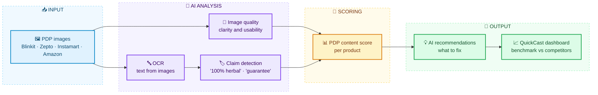

# Rupesh Sahu

### AI Product Engineer · Data & AI Systems

**I build AI products that turn quick-commerce data into decisions, and tools that help people land tech careers.**

---

## 👋 What I Do

I'm the **Market Share Lead at [Trailytics AI](https://trailytics.ai)**. I own products end to end: from the scraping and data pipelines, through analytics and AI, to the SaaS surface brands actually use. My work powers market-share, availability and content decisions for **120+ brands** across India's quick-commerce and e-commerce platforms.

I created **QuickCast**, a quick-commerce intelligence SaaS platform, and I'm building **[WorkDhundo](https://workdhundo.com)** on the side: an end-to-end tech career platform covering jobs, tech learning, upskilling, mentorship and technical interviews, with a hiring product for companies.

---

## 📊 Impact

| 🏷️ Brands | 📦 Categories | 🏙️ Cities | ⚡ Weekly Volume | 🎯 SKU Mapping | 🟡 Blinkit Share Accuracy |
|:---:|:---:|:---:|:---:|:---:|:---:|
| **120+** | **200+** | **120+** | **900M+ records** | **95–97%** | **90%+** |

| Before | After | Improvement |
|:---:|:---:|:---:|
| Scraping runtime: 180 min | **9 min** | **20× faster** |
| Ingestion runtime: 15 min | **32 sec** | **28× faster** |

---

## 🚀 Products I've Built

### QuickCast: Quick-Commerce Intelligence SaaS

Covers **Blinkit · Zepto · Swiggy Instamart · Amazon**.

| Module | Question it answers |
|---|---|
| 📈 **Market Share Intelligence** | Where do we stand against competitors, and how are categories and brands growing? |
| 🛒 **OSA Analytics** | Are our products available on shelf, in which cities? |
| 🆕 **New Product Discovery** | What new launches are competitors shipping? |
| 🖼️ **Content Intelligence** | How good is our product page content (OCR, PDP scoring, AI recommendations)? |
| 📢 **Ad Intelligence** | How are competitors showing up in ads and visibility? |
| 🤖 **AI Insights & Forecasting** | What should we expect next, and what should we do about it? |

---

## 🤖 AI Systems I've Built

### Content Intelligence: OCR-Based PDP Image Scoring

**Problem:** On quick-commerce apps, much of a product's story lives inside the images (claims, badges, ingredients, offers), not in the text fields. Brands had no scalable way to see how good their product pages were against competitors.

**What it does**
- **Reads the images:** OCR pulls text out of product page (PDP) images.
- **Checks image quality:** each image is assessed for how usable and clear it is.
- **Detects claims and remarks:** finds marketing claims such as "100% herbal" or "guarantee" in the extracted text.
- **Scores each page:** image quality and the claims found feed into a PDP content score per product.
- **Recommends fixes:** AI-generated suggestions show brands what to improve.

**Why it matters:** brands can benchmark their content against competitors across thousands of SKUs instead of reviewing pages by hand.

---

## 🔨 Currently Building

### [WorkDhundo](https://workdhundo.com): From Learning Tech to Landing the Job, and Hiring the Talent

One platform that covers the whole tech-career loop, for both sides of the market:

**Jobs → Tech skills → Upskilling → Mentorship → Technical interviews → Companies**

Candidates find jobs, learn in-demand tech, upskill with roadmaps, get mentored, and practise for interviews. Companies then use the same platform to run technical interviews and hire. I'm building it end to end as a two-sided product.

**For learners and job seekers**

| Module | What it offers |
|---|---|
| 🎓 **Expert-Led Courses** | Structured courses on in-demand tech skills, taught by industry practitioners |
| 🗺️ **Structured Roadmaps** | Clear learning paths for every role |
| 🤝 **1-on-1 Mentorship** | Personalised guidance, career coaching and technical interview prep |
| 💼 **Job Board** | Openings across Engineering, Design, Product and Data Science, with personalised job alerts |
| 🏆 **Competitions & Hackathons** | Curated events to showcase skills and compete for prizes |
| 💻 **Practice Problems** | Coding practice to sharpen interview skills |

**For companies and recruiters: Technical Interviews, Reimagined** ([interview.workdhundo.com](https://workdhundo.com))

Host technical interviews and hiring drives on an AI-powered platform: no setup required, with a free trial.

| Feature | What it does |
|---|---|
| ⌨️ **Real-Time Collaborative Coding** | Watch candidates code live in a synchronised editor with multi-language support |
| 👁️ **AI-Powered Proctoring** | Integrity monitoring for fair, secure assessments |
| ✅ **Automated Evaluation** | AI-driven code analysis and automatic scoring |
| 👥 **Multi-User Interview Rooms** | Panel interviews with multiple interviewers in real time |
| ⏪ **Code Playback & Review** | Replay candidate sessions with full playback and detailed analytics |
| 💬 **Integrated Communication** | Built-in chat and video conferencing for seamless candidate interaction |

**What this shows:** product thinking across both sides of a market (candidates and hiring teams), real-time collaboration, AI-assisted evaluation, and full-stack ownership.

---

## 🧩 Case Studies

### 1. Market Share Analytics Platform
- **Challenge:** Brands needed reliable market share and sales estimates across fast-moving quick-commerce platforms.
- **What I did:** Built the platform from scratch: scraping, SKU mapping, sales estimation and analytics.
- **Result:** **95–97% SKU mapping accuracy** and **90%+ market share accuracy on Blinkit**, serving 120+ brands across 200+ categories.

### 2. Data Pipeline Performance
- **Challenge:** Long scraping and ingestion runs slowed down data freshness at scale.
- **What I did:** Re-engineered the scraping and ingestion pipelines.
- **Result:** Scraping **180 → 9 min**, ingestion **15 min → 32 sec**, on 900M+ records a week.

### 3. QuickCast
- **Challenge:** Brand teams had data scattered across separate tools and spreadsheets.
- **What I did:** Packaged market share, OSA, NPD, content and ad intelligence into one SaaS product.
- **Result:** A single platform trusted by brands including **Colgate, Nivea, Cipla, Mars, Danone, HUL and Mondelez**.

### 4. WorkDhundo
- **Challenge:** Tech learners juggle separate tools for jobs, courses, upskilling, mentorship and interview prep, while companies struggle to run fair, structured technical interviews.
- **What I did:** Designed and built a two-sided platform: a job-to-upskilling-to-mentorship pathway for candidates, and a live-coding interview platform with AI proctoring and automated evaluation for company hiring teams.
- **Result:** One product covering the full journey, from finding a job and learning tech, through mentorship and technical interviews, to the company that hires.

---

## 🛠️ How I Work

- **Product first:** start from the decision a brand has to make, then work backward to the data.
- **End-to-end ownership:** discovery, pipelines, analytics, UI and AI in one loop.
- **Accuracy as a feature:** measure and publish accuracy (SKU mapping, share) instead of assuming it.
- **Performance matters:** faster pipelines mean fresher insights.
- **Cross-functional leadership:** I work across product, data and engineering.

---

## 🧰 Tech Stack

| Layer | Tools |
|---|---|
| **Data & Analytics** | ClickHouse · Pandas · NumPy · Power BI · PostgreSQL · MySQL · MongoDB · Redis |
| **Backend** | Python · FastAPI · Node.js · Java · Spring |
| **Frontend** | React · TypeScript · JavaScript |
| **AI** | Gemini AI · OCR · LLM-based insights |
| **Infra** | AWS · Docker · Kubernetes · Git |

---

## 🌱 Currently Exploring

`Agentic AI` · `LLM Engineering` · `AI Product Architecture` · `ClickHouse at Scale` · `Advanced AWS` · `Autonomous AI Workflows` · `Enterprise SaaS` · `Real-Time Collaboration` · `AI Proctoring & Evaluation`

## 🎯 2026 Goals

- [ ] Build India's leading quick-commerce intelligence platform
- [ ] Scale QuickCast across more brands and categories
- [ ] Launch and grow WorkDhundo (learners, job board and interview platform)
- [ ] Ship enterprise-grade AI products and forecasting systems
- [ ] Contribute more to open source

---

## 🤝 Let's Talk

Building AI products, data platforms or commerce intelligence? Hiring or learning in tech? Reach me at [rupeshsahu098765@gmail.com](mailto:rupeshsahu098765@gmail.com) or on [LinkedIn](https://www.linkedin.com/in/rupesh-sahu-audiorpod/).

---

**Turning Commerce Data into Intelligence 🚀**

